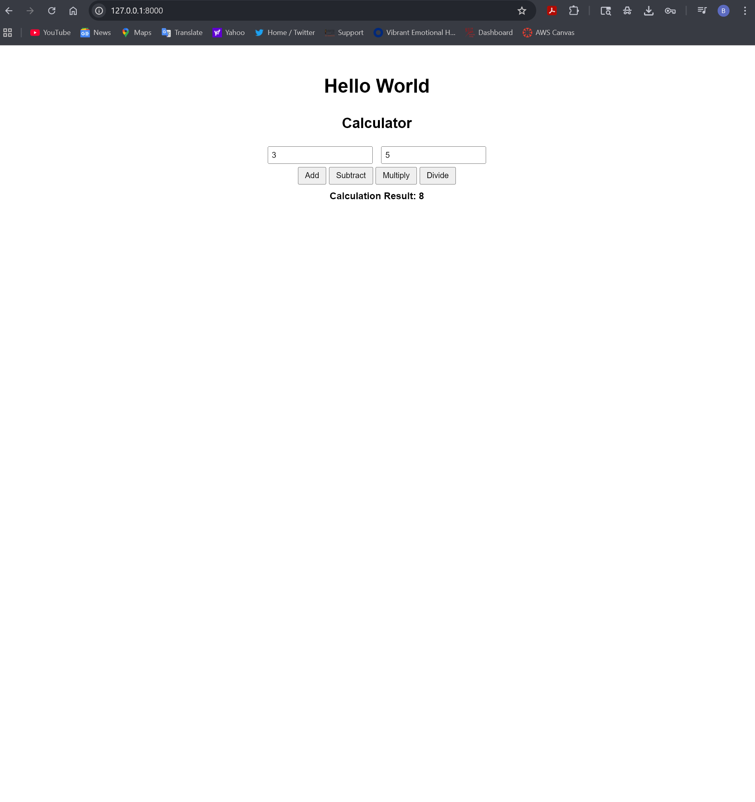
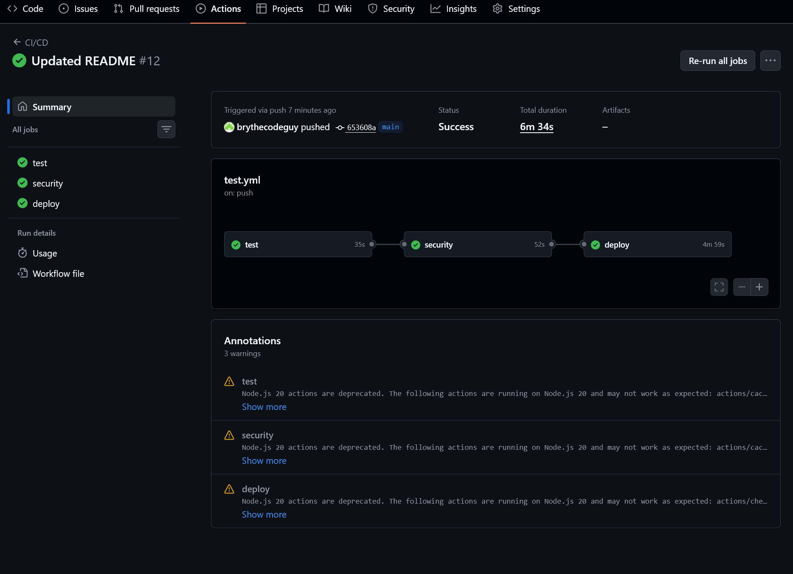

# Module 8: FastAPI Calculator Application

This project  built upon a starter template provided by the professor, with additional enhancements and testing implemented by the author. This project is a simple calculator web application built using FastAPI.  
It supports basic arithmetic operations and includes testing, logging, and containerization.

---

## Features

- Add, subtract, multiply, and divide operations
- FastAPI backend with REST endpoints
- Simple frontend using HTML templates
- Input validation using Pydantic
- Logging for requests, validation, and results
- Docker support for deployment

---

## Testing

This project includes multiple layers of testing:

- Unit tests for calculator operations
- Integration tests for API endpoints
- End-to-End (E2E) tests using Playwright

The project achieves high test coverage with validation of normal cases, edge cases, and error handling.

---

## Screenshots

### Application Running



### GitHub Actions



---

## How to Run Locally

### 1. Install dependencies

```bash
pip install -r requirements.txt
```

### 2. Start the application

```bash
uvicorn main:app --reload
```

### 3. Open in browser

<http://127.0.0.1:8000>

---

## Running Tests

```bash
pytest --cov=app --cov=main
```

---

## Docker

### Build the image

```bash
docker build -t fastapi-calculator .
```

### Run the container

```bash
docker run -p 8000:8000 fastapi-calculator
```

---

## Notes

This project builds upon a provided starter template.  
Additional tests, logging, and validation were implemented to improve coverage and overall reliability.
